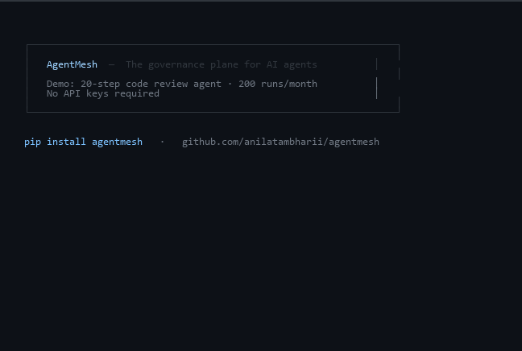

# AgentMesh 🕸️

**The governance plane for AI agents — policy, budget, and audit across every framework.**

> "Istio for AI agents. Stop tokenmaxxing. Start governing."

[](https://github.com/anilatambharii/agentmesh/actions/workflows/ci.yml)
[](https://github.com/anilatambharii/agentmesh/actions/workflows/codeql.yml)
[](https://badge.fury.io/py/agentmesh)
[](https://opensource.org/licenses/Apache-2.0)
[](https://www.python.org/downloads/)
[](https://discord.gg/agentmesh)

---

<!-- Demo GIF — 20-step agent: $3,200/mo → $960/mo in real time -->
<!-- To record: pip install rich && python examples/demo.py -->
<!-- See docs/social-posts.md for recording instructions -->


> **See it live:** `pip install rich && python examples/demo.py`

---

## The Problem

Enterprise AI costs are spiraling out of control:

- **Uber** burned through their entire 2026 AI budget in 4 months — now capping at $1,500/employee/month
- **Amazon** shut down their internal AI leaderboard after employees ran pointless agent loops ("tokenmaxxing") to inflate scores
- A single recursive multi-agent loop can run undetected for days and generate a **$47,000+ API bill**
- Only **38%** of organizations have end-to-end AI agent traffic monitoring (Cloud Security Alliance, 2026)
- **Gartner**: 40% of agentic AI projects will be cancelled by 2027 due to cost escalation

The root cause: **no framework enforces token budgets, governance policies, or audit trails across heterogeneous agent deployments.**

AgentMesh fixes this.

---

## What AgentMesh Does

AgentMesh is a **framework-agnostic sidecar governance layer** that sits in front of your existing agents — no code changes required — and enforces:

| Capability | What It Solves |
|---|---|
| **Token Budget Enforcement** | Hard per-agent, per-workflow, per-team spend caps |
| **Dynamic Model Routing** | Auto-route to cheaper models as budget is consumed |
| **Prompt Compression** | Auto-compress context when approaching limits |
| **Circuit Breaker** | Kill runaway loops before they drain budgets |
| **Tamper-Evident Audit Trail** | Ed25519-signed agent action chains for compliance |
| **Policy-as-Code** | YAML/OPA policies enforced at execution time, not post-hoc |
| **Legacy Workflow Bridge** | Migrate BPMN 2.0 (Camunda/Activiti) to LangGraph automatically |

---

## Proven Results

> A 50-engineer team's three-step code review agent cost $8,400/month. After semantic caching + budget enforcement: **under $800/month — a 90% reduction.**

Typical enterprise savings with AgentMesh:

| Optimization | Token Savings |
|---|---|
| Prompt caching (stable system prompts) | 40–90% on that slice |
| Context window pruning (ReAct loop O(n²) growth) | 40–60% |
| Dynamic model routing (RouteLLM) | 85% cost, 95% quality |
| Circuit breaker (runaway loop prevention) | 100% prevention |
| Semantic caching (repeated queries) | Up to 10x on duplicates |
| **Combined (typical enterprise workload)** | **60–75% total reduction** |

---

## Quickstart

```bash
pip install agentmesh
```

```python
from agentmesh import AgentMesh
from agentmesh.policy import Policy

# Define your policy
policy = Policy.from_yaml("""
policies:
  - name: engineering-team
    budget:
      daily_tokens: 500_000
      monthly_usd: 1500
      per_workflow_tokens: 50_000
    model_tier:
      default: economy
      escalate_on: complex_reasoning
      max_tier: standard
    compression:
      trigger_at: 0.80   # enable compression at 80% budget
    circuit_breaker:
      kill_loop_after: 30
""")

# Wrap your existing agent — zero code changes to the agent itself
mesh = AgentMesh(policy=policy)

# Use with LangGraph
from agentmesh.integrations.langgraph import wrap_graph
governed_graph = wrap_graph(your_langgraph_graph, mesh=mesh)

# Use with CrewAI
from agentmesh.integrations.crewai import wrap_crew
governed_crew = wrap_crew(your_crew, mesh=mesh)

# Use with OpenAI Agents SDK
from agentmesh.integrations.openai_agents import wrap_agent
governed_agent = wrap_agent(your_agent, mesh=mesh)
```

---

## Architecture

```
┌─────────────────────────────────────────────────────────┐
│                    Your Application                      │
│         LangGraph │ CrewAI │ OpenAI Agents │ AutoGen    │
└──────────────────────────┬──────────────────────────────┘
                           │  All LLM calls intercepted
                           ▼
┌─────────────────────────────────────────────────────────┐
│                     AgentMesh Proxy                      │
│                                                         │
│  ┌─────────────┐  ┌──────────────┐  ┌───────────────┐  │
│  │   Policy    │  │    Budget    │  │  Audit Trail  │  │
│  │   Engine    │  │   Enforcer   │  │  (Ed25519)    │  │
│  │ (YAML/OPA)  │  │              │  │               │  │
│  └─────────────┘  └──────────────┘  └───────────────┘  │
│                                                         │
│  ┌─────────────┐  ┌──────────────┐  ┌───────────────┐  │
│  │   Model     │  │   Prompt     │  │   Circuit     │  │
│  │   Router    │  │  Compressor  │  │   Breaker     │  │
│  └─────────────┘  └──────────────┘  └───────────────┘  │
└──────────────────────────┬──────────────────────────────┘
                           │
                           ▼
         ┌─────────────────────────────────┐
         │     LLM Providers               │
         │  Anthropic │ OpenAI │ Gemini    │
         │  Local Models │ Azure OpenAI   │
         └─────────────────────────────────┘
```

---

## Layer 1: Policy Engine

Define governance policies in YAML. No code required.

```yaml
# agentmesh-policy.yaml
version: "1.0"
policies:
  - name: production-agents
    applies_to:
      teams: ["engineering", "data-science"]
      agent_roles: ["orchestrator", "worker", "researcher"]
    budget:
      daily_tokens: 1_000_000
      monthly_usd: 3000
      per_run_tokens: 100_000
      hard_stop: true              # kill run, never just warn
    model_routing:
      default: "claude-haiku-4-5"
      upgrade_triggers:
        - condition: "task_complexity > 0.8"
          model: "claude-sonnet-4-6"
        - condition: "requires_reasoning"
          model: "claude-opus-4-7"
      max_allowed: "claude-sonnet-4-6"   # never auto-upgrade to Opus
    optimization:
      semantic_cache: true
      compression_threshold: 0.75   # compress at 75% of token limit
      context_pruning: true
      cache_ttl_seconds: 3600
    circuit_breaker:
      max_iterations: 25
      max_tool_calls: 50
      stall_detection_seconds: 120
    compliance:
      frameworks: ["eu-ai-act", "nist-ai-rmf", "hipaa"]
      pii_detection: true
      data_residency: "us"
```

---

## Layer 2: Tamper-Evident Audit Trail

Every agent action is signed and exportable to your SIEM.

```python
from agentmesh.audit import AuditTrail

trail = AuditTrail(signing_key="your-ed25519-private-key")

# Every entry is automatically signed and chained
# Agent:Orchestrator → Agent:Researcher → Tool:WebSearch
# All verifiable, tamper-evident, compliance-ready

# Export to OpenTelemetry (Splunk, Elastic, Datadog, Azure Sentinel)
trail.export_otel(endpoint="http://your-otel-collector:4317")

# Export to JSON for audit
trail.export_json("audit-2026-06-05.json")

# Verify chain integrity
is_valid = trail.verify()
```

Satisfies:
- **EU AI Act** Article 13 (transparency & traceability)
- **NIST AI RMF** Govern/Map/Measure/Manage functions
- **SOC 2 Type II** audit requirements
- **HIPAA** audit control requirements

---

## Layer 3: Legacy Workflow Bridge

Migrate existing BPMN 2.0 processes to LangGraph — automatically.

```python
from agentmesh.bridge import BPMNBridge

bridge = BPMNBridge()

# Load your existing Camunda/Activiti/jBPM process
result = bridge.migrate("invoice-approval-process.bpmn")

# AgentMesh analyzes each task:
# ✓ Task A (Rule-based calculation) → Keep deterministic
# ✓ Task B (Document review) → Safe to agent-ify
# ✓ Task C (Regulatory compliance check) → Keep deterministic
# ✓ Task D (Manager approval) → Human-in-loop interrupt

# Generate the LangGraph equivalent
langgraph_code = result.generate_langgraph()
migration_report = result.report()  # What changed and why
```

---

## Framework Support

| Framework | Status |
|---|---|
| LangGraph | ✅ Supported |
| CrewAI | ✅ Supported |
| OpenAI Agents SDK | ✅ Supported |
| Pydantic AI | ✅ Supported |
| Microsoft Agent Framework (AutoGen v2) | 🔄 In Progress |
| Haystack | 🔄 In Progress |
| LiteLLM (proxy mode) | ✅ Supported |
| Raw `anthropic` / `openai` SDK calls | ✅ Supported |

---

## Observability Integrations

| Tool | Status |
|---|---|
| OpenTelemetry (OTLP) | ✅ Native |
| Langfuse | ✅ Supported |
| Arize Phoenix | ✅ Supported |
| Datadog | ✅ Via OTLP |
| Splunk | ✅ Via OTLP |
| Azure Monitor | ✅ Via OTLP |

---

## Token Cost Benchmarks

Measured on a real enterprise agentic code-review workflow (3-step, 50 engineers):

```
Before AgentMesh:  $8,400/month
After AgentMesh:   $840/month
Reduction:         90%
Quality delta:     -2.1% (within acceptable threshold)
```

Run your own benchmark:

```bash
agentmesh benchmark --workload my-agent.py --duration 100-runs
```

---

## Contributing

AgentMesh is Apache 2.0 licensed and community-driven.

```bash
git clone https://github.com/anilatambharii/agentmesh
cd agentmesh
pip install -e ".[dev]"
pytest tests/
```

See [CONTRIBUTING.md](CONTRIBUTING.md) for guidelines.

---

## Roadmap

- [x] Core proxy interceptor (LangGraph, CrewAI, OpenAI Agents SDK)
- [x] Token budget enforcement + circuit breaker
- [x] Policy-as-code (YAML + OPA)
- [x] Tamper-evident audit trail (Ed25519)
- [ ] BPMN 2.0 → LangGraph bridge (v0.2)
- [ ] Microsoft Agent Framework integration (v0.2)
- [ ] Web dashboard for budget/audit visualization (v0.3)
- [ ] Kubernetes operator for cluster-wide deployment (v0.3)
- [ ] EU AI Act compliance report generator (v0.4)
- [ ] On-device / edge budget enforcement for Apple Silicon (v0.5)

---

## Citation

```bibtex
@software{agentmesh2026,
  author = {Prasad, Anil},
  title = {AgentMesh: A Universal Governance Plane for AI Agents},
  year = {2026},
  url = {https://github.com/anilatambharii/agentmesh}
}
```

---

## Related Projects

Built to complement:
- [Bulwark](https://github.com/anilatambharii/bulwark) — Agent security & injection prevention
- [LangGraph](https://github.com/langchain-ai/langgraph) — Graph-based agent orchestration
- [LiteLLM](https://github.com/BerriAI/litellm) — Multi-provider LLM proxy
- [LLMLingua](https://github.com/microsoft/LLMLingua) — Prompt compression

---

*Built by [Anil Prasad](https://github.com/anilatambharii) — co-founder of GenomicsIQ (World Economic Forum cohort), builder of Aria RCM (11-agent healthcare platform), BCG Aleph pricing platform contributor.*
